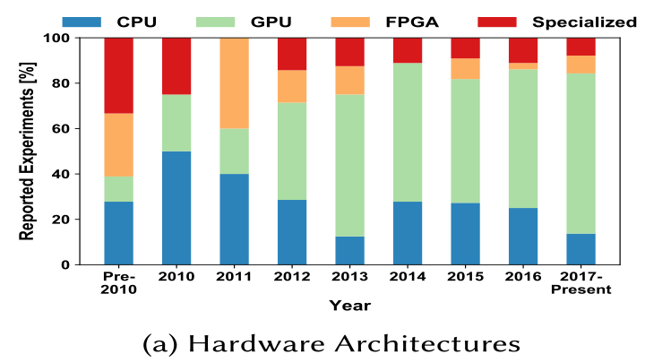
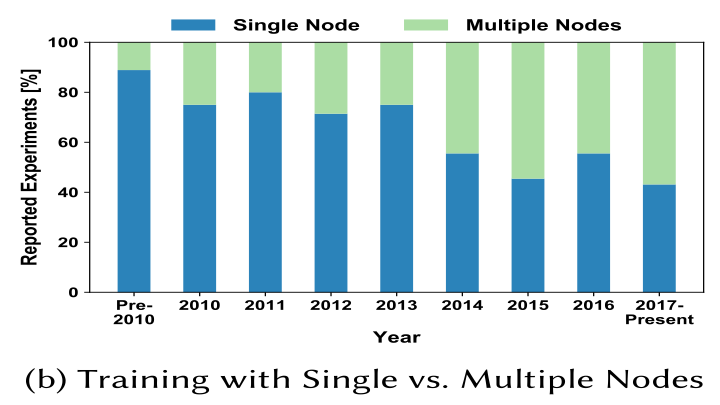
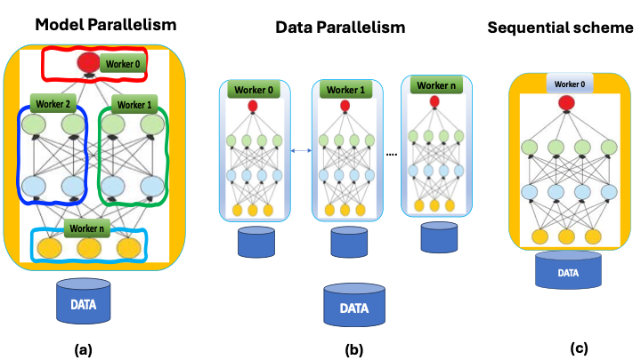
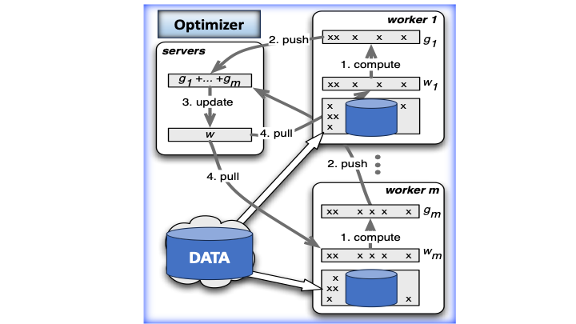
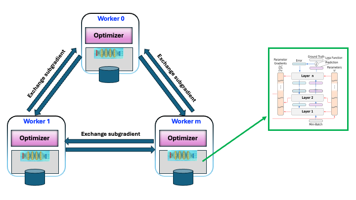
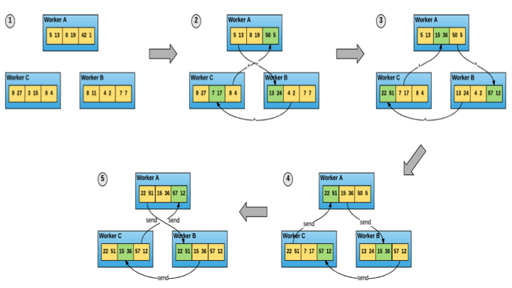
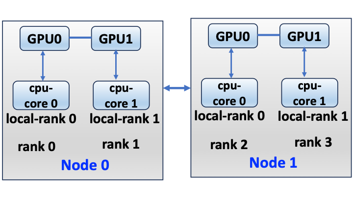
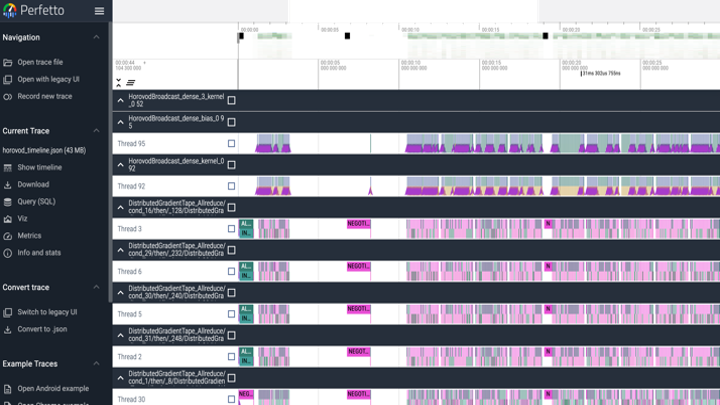

**Distributed Training for Large-scale Computation**

**Abstract**

Distributed deep learning presents significant challenges in terms of
scalability, efficiency, and ease of implementation. Here we review the
concept of different training strategies covering both model parallelism
and data parallelism, and discuss their key features...

A special focus on Horovod, which we present a step-by-step guide on how
to transform a single-GPU workload to multiple GPU across multiple
nodes. We conduct experiments on two distinct HPE Cray systems powered
with HPE Slingshot Network, in which (i) equipped with NVIDIA
Grace-Hoper superchip and (ii) AMD MI250X GPU.

**Concept of Distributed DNN training**

Training deep neural networks (DNNs) on large datasets can be
computationally expensive and time-consuming and often constrained by:

- Memory limitations: Large models and/or datasets may exceed a single
  GPU memory capacity.

- Batch size restrictions: Limited GPU memory forces smaller batch
  sizes, thus affecting both performance and convergence.

To address these challenges, the use of distributed training frameworks
optimized for large **high-performance computing (HPC)** systems powered
by Graphics Processing Unit (GPU) accelerators becomes essential.

Over the past decade, GPUs have become the dominant hardware choice for
accelerating deep learning (DL) applications, as evidenced by a recent
survey on machine learning (ML) hardware architectures \[Ben-Nun2019\].
In this survey \[Ben-Num2019\], among the 252 papers reviewed, 159
disclosed their hardware setups, revealing a clear shift toward
GPU-based computing as shown in **Fig. 1(a)**. meanwhile, multi-node
parallelism has seen rapid growth as illustrated in **Fig. 1(b)**. In
the beginning of 2015, distributed-memory architectures with GPU
accelerators emerged as the standard for scalable ML workloads,
solidifying their role as the default option across all levels of
deployment.

  
  

<figcaption style="text-align: center; margin-top: 10px; margin-bottom: 10px;">
  <strong>Fig. 1</strong>: From [Ben-Num2019] Reported experiments per year categorized by 
  <strong>(a)</strong> Hardware architectures and <strong>(b)</strong> memory architecture (i.e. shared vs distributed).
</figcaption>
  

Despite their advantage, multi-GPU scaling of training across multiple
nodes introduces significant challenges--- particularly communication
overhead resulted from inter-node data transfer during training. Here,
effective scaling of DL workload requires optimized strategies to
mitigate these additional overheads.

**Distributed DNN Training: Parallelism Schemes**

Distributed DNN training can be categorized as model parallelism and
data parallelism (see e.g. \[Ben-Num2019\]); their schematic
representation is depcited in **Fig. 2**. In model parallelism, the
target model is partitioned into multiple pieces, and each partition is
assigned to each worker for training as illustrated in **Fig. 2(a)**.
While in data parallelism, the target model is replicated across
multiple workers, such that each worker processes a different subset of
the training dataset as presented in **Fig. 2(b)**. This is similar to
training on a single worker (cf. **Fig. 2(c)**), but each worker
operates on different set of data.

  

<figcaption style="text-align: center; margin-top: 10px; margin-bottom: 10px;">
  <strong>Fig. 2</strong>: Parallelism schemes:
  <strong>(a)</strong> Model parallelism and <strong>(b)</strong> Data
  parallelism. <strong>(c)</strong> refers to a sequential scheme.
</figcaption>
  

While both model and data parallelism are viable strategies for scaling
large deep learning workloads, data parallelism has gained wider
adoption due to its simplicity and scalability. A notable example is
Facebook's work \[Goyal2017\], which demonstrated training a ResNet-50
model in just one hour across 256 GPUs. This was achieved by combining
data parallelism with a novel learning rate adjustment technique.

In this work, we consequently focus on data parallelism-based approach.
In this approach, each worker computes gradients for the corresponding
training dataset by performing a forward/backward pass, just as in a
single worker scheme. The computed gradients are aggregated and used to
update the weights. Here, the equation representing the **gradient** for
distributed DNN training can be written as:

∇ₓf(w;X) = (1/N) \* \[\
   (1/B) ∑*{i=1→B} ∇ₓc\'(w,xᵢ) +\
   (1/B) ∑*{i=B+1→2B} ∇ₓc\'(w,xᵢ) +\
  \... +\
   (1/B) ∑\_{i=(N-1)B+1→NB} ∇ₓc\'(w,xᵢ)\
\]

where

- **∇ₓf(w;X)**: Full-batch gradient of loss function **f** with weights
  w over dataset **X.**

<!-- -->

- **N**: Number of parallel workers/mini-batches

- **B**: Batch size per worker

- **c\'(w,xᵢ)**: Loss gradient for sample xᵢ

The concept of data parallelism can be categorized into two types of
*centralization architectures*: *Centralized* and *decentralized*
distributed DNN training \[Ben-Num2019\].

***Centralized* Distributed DNN Training**

Centralized distributed training is a concept in deep learning where the
architecture consists of workers and parameter servers, each with
distinct yet complementary roles. In thi concept, the parameter server
enables distributed training by centralizing gradient management. The
centrelized network architecture is depicted in **Fig. 3** and the basic
worflow is summerized below:

1.  **Parameter Servers** act as central coordinators that:

    - Collect subgradients from workers.

    - Compute the global gradient.

    - Update the model weights.

2.  **Workers** perform computation by:

    - Pulling the latest weights from the server.

    - Computing subgradients on their local data subsets.

    - Sending subgradients back to the server.

3.  **Communication Pattern**:

    - Workers communicate *only* with servers (no peer-to-peer
      communication).

    - All gradient aggregation is server-centric.

4.  **Scalability Limitations**:

    - Communication overhead grows with the number of workers.

    - Poor scaling efficiency due to server bottlenecks.

Although centralized network architectures simplify worker-server
coordination, they incur substantial communication overhead as the
system grows, since all workers interact directly with the parameter
server. With more workers, parameter servers become bottlenecks, thus
leading to degraded efficiency. This limitation results in poor
scalability for large-scale deployments.

  

<figcaption style="text-align: center; margin-top: 10px; margin-bottom: 10px;">
  <strong>Fig. 3</strong>: Adapted from [Li2014,Teo2007]. Workflow of Distributed
Subgradient Descent in Parameter Server Architecture.
</figcaption>
  

***Decentralized* Distributed DNN Training**

Decentralized distributed training is based on the concept of collective
communication in which workers communicate to each other in a form of
Ring-Allreduce. As depicted in **Fig. 4**, the decentralized network
architecture operates through the following basic workflow:

1.  **Elimination of Parameter Servers**:

    - No central coordination; all workers operate peer-to-peer.

2.  **Local Gradient Computation & Exchange**:

    - Each worker computes its own (sub)gradient and shares it
      exclusively with neighboring workers (typically in a Ring
      topology).

    - Each worker contains an optimizer, which is responsible for
      updating model parameters based on local computations.

3.  **Independent Weight Management**:

    - Workers compute and maintain their own weight updates.

    - *No* weight exchange occurs between workers---only gradients (or
      subgradients) are shared.

  

<figcaption style="text-align: center; margin-top: 10px; margin-bottom: 10px;">
  <strong>Fig. 4</strong>: Architecture of decentralized distributed training in a
Ring topology. The inset figure is taken from \[Langer2020\]: neural
network architecture with multiple layers, illustrating the flow of
gradients during backpropagation.
</figcaption>
  

The concept of data parallelism---encompassing both centralized and
decentralized architectures---is implemented in various machine learning
frameworks, many of which also integrate model parallelism. These
frameworks are summarized in **Table 1** including their parallelization
capabilities.

**Table 1:** *Summary of Parallelism and Communication Strategies in ML
Frameworks from \[Aach2023\] (see also \[Li2020,Rasely2020\]).*

  -----------------------------------------------------------------------
  **Framework**           **Parallelism**         **Communication**
  ----------------------- ----------------------- -----------------------
  DistBelief              Model + Data            Asynchronous

  FireCaffe               Data                    Synchronous

  Horovod                 Data                    Synchronous

  MXNet                   Model + Data            Bounded Asynchronous

  Petuum                  Model + Data            Bounded Asynchronous

  TensorFlow              Model + Data            Bounded Asynchronous

  PyTorch-DDP             Model + Data            Synchronous

  DeepSpeed               Model + Data            Synchronous
  -----------------------------------------------------------------------

Choosing the right DL framework for implementing a distributed training
strategy is not trivial. Generally, the selection is based on the
framework's efficiency, which is evaluated through its scalability,
performance, and ease of implementation. Scalability in DL comes with
several challenges, particularly the communication overhead caused by
frequent synchronization and data exchange between multiple processes
during training. Therefore, the optimal choice depends on the
implementation of efficient communication algorithms within the
framework---such as ring-based AllReduce methods---which are essential
for minimizing latency. In the following, we choose Horovod framework,
as it has proven to be well-suited for large-scale training
\[Sergeev2018\].

**Distributed DNN Training with [Horovod]{.underline}**

**What is Horovod ?**

Horovod is an open-source distributed training framework developed by
Uber \[Sergeev2018, Horovod-GitHub\] to simplify and accelerate deep
learning workloads on multiple GPUs across multiple nodes. Horovod
provides functions which integrate existing DL frameworks: TensorFlow,
Keras, PyTorch, Apache MXNet. It is built on the top of communication
libraries, in particular, Message Passing Interface (MPI), NVIDIA
Collective Communications Library (NCCL) and Gloo. These libraries
provide the underlying communication infrastructure needed for
distributed training across multiple nodes and GPUs. This enables users
to have flexibility in choosing the appropriate backend (MPI, NCCL, or
Gloo) based on their hardware and software environment. By default,
Horovod uses OpenMPI, but it can be re-compiled and linked against Cray
MPICH \[Horovod-doc\].

The particularity of Horovod lies in the following three key advantages
\[Sergeev2018\]:

- **Ease of Implementation:** Horovod simplifies scaling a single-GPU
  application to run across multiple GPUs and nodes, reducing the
  complexity of distributed training.

- **Efficient Communication Handling:** It employs optimized algorithms
  to minimize communication overhead, particularly in inter-GPU
  communications. In data parallelism, workers compute sub-gradients,
  which must be aggregated to form the full gradient---a process that
  can be time-consuming. Horovod leverages **MPI-allreduce** to
  efficiently synchronize gradients across workers, reducing
  bottlenecks.

- **High-Performance Network Utilization:** Horovod maximizes fast
  network capabilities while maintaining simplicity.
  The **allreduce** approach is both network-efficient and
  user-friendly. By integrating with MPI implementations, it handles
  distributed infrastructure setup automatically. Users only need to
  modify their code to average gradients using **allreduce()**,
  streamlining the adoption process.

**Concept of Horovod**

The core concept of Horovod is inspired by the following points:

- **Decentralised data parallelism scheme** \[Goyal2017\]:

> Horovod builds upon Facebook\'s work \[Goyal2017\] based on
> decentralized training approach (see **Figure 4**), which eliminates
> the performance bottlenecks inherent to parameter server architectures
> (see **Figure 3**). This design enables more efficient scaling across
> multiple nodes. As shown in Uber\'s benchmarks \[Sergeev2018\],
> distributed training with Horovod achieved **88% scaling
> efficiency** on 128 GPUs, which is twice faster than the standard
> distributed TensorFlow \[Sergeev2018\].

- **Adjusting learning rate technique** \[Goyal2017\]:

> Horovod Implements Facebook\'s linear scaling rule for large batches.
> Here, when increasing the
>
> batch size by N times (for N GPUs), the base learning rate should also
> scale linearly to maintain
>
> gradient variance. This rule enables stable training on 256+ GPUs
> (e.g., 1-hour ResNet-50
>
> training) \[Goyal2017\].

- **Optimal bandwidth ring-allreduce** \[Patarasuk2009, Gibiansky2017\]:

> The particularity of Horovod lies in its implementation of the
> ring-allreduce algorithm \[Patarasuk2009\], illustrated in **Figure
> 5**. In this scheme, each worker (GPU) communicates directly with two
> adjacent neighbors in a ring topology. This design provides two key
> advantages: (i) it enables overlapping of communication (data
> transfer) with computation (backpropagation), and (i) it optimizes
> network bandwidth utilization. As a result, the algorithm achieves
> exceptional communication efficiency by minimizing latency - a
> critical factor for scalable distributed training.

  

<figcaption style="text-align: center; margin-top: 10px; margin-bottom: 10px;">
  <strong>Fig. 5</strong>:  Diagram of ring-allreduce algorithm designed for gradient
synchorinization. Figure taken from \[Sergeev2018\].
</figcaption>
  

**Implementation of Horovod with TensorFlow**

We describe below a step-by-step guide on implementing Horovod with
TensorFlow \[Sergeev2018, Horovod-doc\]. The implementation is based on
the concept described above.

**0- Import Horovod**

**import horovod.tensorflow as hvd**

**1- Initialize Horovod**

**hvd.init()**

**2- Assign each GPU to a single process (local rank, cf. Fig. 6)**

**gpus = tf.config.experimental.list_physical_devices(\'GPU')**

**for gpu in gpus:**

**tf.config.experimental.set_memory_growth(gpu, True)**

**if gpus:**

**tf.config.experimental.set_visible_devices(gpus\[hvd.local_rank()\],
\'GPU')**

**3- Scale learning rate after warm up (\~ 3 epochs)**

**learning_rate = learning_rate \* hvd.size()**

**Effective batch size = batch size x Nbr of devices**

An increase in learning rate compensates the increased batch size.

**4-Apply Horovod distributed optimizer to the original optimizer**

**The function takes care of averaging gradients using ring-allreduce**

**Opt = hvd.DistributedOptimizer(Opt)**

**Or**

**hvd.DistributedGradientTape if using tf.GradientTape**

**5-Broadcast initial variables from rank==0 to all processes**

**hvd.broadcast_variables**

**6-Save checkpoints on rank==0**

**checkpoint.save() when hvd.rank() == 0**

  

<figcaption style="text-align: center; margin-top: 10px; margin-bottom: 10px;">
  <strong>Fig.6</strong>:  Schematic representation of assigning each local process
(cpu-core) to a specific GPU within a node.
</figcaption>
  

**Horovod timeline for Profiling**

Horovod comes with Horovod Timeline---a built-in profiling tool designed
to monitor and optimize distributed deep learning workloads
\[Horvbod-profiling\]. The tool provides a visual timeline of operations
across all workers, helping users identify bottlenecks in computation,
communication, or synchronization.

To enable profiling the environment variable **HOROVOD_TIMELINE** should
be set to save a JSON trace e.g. **export
HOROVOD_TIMELINE=./horovod_timeline.json**

The generated file **horovod_timeline.json** can be viewed using a trace
viewer e.g. <https://ui.perfetto.dev/>

An example of Horovod timeline profile, which captures detailed
performance metrics from a distributed training job is shown in **Fig.
7**.

  

<figcaption style="text-align: center; margin-top: 10px; margin-bottom: 10px;">
  <strong>Fig.7</strong>: Horovod profiler recording timeline of operations.
</figcaption>
  

**Application: MNIST dataset training**

To better illustrate the step-by-step guide presented in Section.., we
provide a practical example based on training the MNIST dataset using
TensorFlow. Here, we convert a single-GPU scenario into a distributed
training environment spanning multiple GPUs and nodes \[Agueny2024\]
using Horovod. We restructure the process of distributed training into
three keys steps:

a)  Initialization

b)  Data parallelism

- Pre-processing

- Distributed optimizer

- Synchronization (Broadcasting & Learning-rate scaling)

c)  Saving Checkpoints

Guided by this structure, we proceed with the following implementation:

(a) **Initialization**

**\# Single-GPU training**

**def train(learning_rate,batch_size,epochs):**

**\# Import tensorflow modules**

**import tensorflow as tf**

**from tensorflow import keras**

**\# Distributed training with Horovod**

**def train_hvd(learning_rate,batch_size,epochs):**

**\# Import tensorflow modules**

**import tensorflow as tf**

**from tensorflow import keras**

**import horovod.tensorflow.keras as hvd**

**\# Initialize Horovod**

**hvd.init()**

**#List GPUs**

**gpus =**

**tf.config.experimental.list_physical_devices(\'GPU\')**

**for gpu in gpus:**

**tf.config.experimental.set_memory_growth(gpu, True)**

**\# Assign each GPU to each local rank**

**if gpus:**

**tf.config.experimental.set_visible_devices(**

**gpus\[hvd.local_rank()\],\'GPU')**

(b) **Data Parallelism**

- **Pre-processing**

**\# Single-GPU training**

**def train(learning_rate,batch_size,epochs):**

**.......**

**......**

**\# Prepare dataset**

**\# Here the default is rank=0, size=1**

**(x_train, y_train), (x_test, y_test) = get_dataset()**

**\# Distributed training with Horovod**

**def train_hvd(learning_rate,batch_size,epochs):**

**........**

**.......**

**\# Prepare dataset**

**\# The data is partitioned according to the nbr of processes**

**(x_train, y_train), (x_test, y_test) = get_dataset(**

**hvd.rank(), hvd.size())**

**train_data = train_data.shard(num_shards=hvd.size(),**

**index=hvd.rank())**

- **Distributed optimizer**

**\# Single-GPU training**

**.......**

**......**

**\# Initialize DNN model**

**model = get_model()**

**\# Specify the optimizer:**

**optimizer = keras.optimizers.Adadelta(**

**learning_rate)**

**\# Distributed training with Horovod**

**........**

**.......**

**\# Initialize DNN model**

**model = get_model()**

**\# Specify the optimizer:**

**\# Scale the learning rate with the total number of GPUs**

**optimizer = keras.optimizers.Adadelta(**

**learning_rate=learning_rate \* hvd.size())**

**\# Use the Horovod Distributed Optimizer**

**optimizer = hvd.DistributedOptimizer(optimizer)**

- **Synchronization** (Broadcasting & Learning-rate scaling)

**\# Single-GPU training**

**.......**

**......**

**\# Compile the model**

**model.compile(optimizer=optimizer,**

**loss=\'categorical_crossentropy\',**

**metrics=\[\'accuracy'\])**

**\# Distributed training with Horovod**

**........**

**.......**

**\# Compile the model**

**model.compile(optimizer=optimizer,**

**loss=\'categorical_crossentropy\',metrics=\[\'accuracy'\],**

**experimental_run_tf_function=False)**

**\# Create a callback to broadcast**

**callbacks = \[**

**#Broadcast the initial variable from rank 0 to all ranks.**

**hvd.callbacks.BroadcastGlobalVariablesCallback(0),**

**#Average metrics at the end of every epoch.**

**hvd.callbacks.MetricAverageCallback(),**

**#Scale the learning rate \`lr = lr \* hvd.size()\`.**

**#warmup_epochs could be adjusted.**

**hvd.callbacks.LearningRateWarmupCallback(**

**lr=1e-3\*hvd.size(), warmup_epochs=3, verbose=1)\]**

- The callbacks function ensures consistent initialization of all
  workers training is started with random weights or restored from a
  checkpoint.

- Scaling LR from the very beginning results in lower final accuracy.
  Scaling LR should be applied after e.g. 3 epochs. See \[Goyal2018\]
  for more details.

(c) **Checkpoints**

**\# Distributed training with Horovod**

**def train_hvd(learning_rate,batch_size,epochs):**

**...**

**.......**

**\# Save checkpoints during training only on worker 0**

**if hvd.rank() == 0:**

**callbacks.append(**

**keras.callbacks.ModelCheckpoint(checkpoint_file,**

**monitor=\'val_loss\',**

**mode=\'min\',**

**save_best_only=True))**

**\# Train the model**

**model.fit(x_train,**

**y_train,**

**batch_size=batch_size,**

**callbacks=callbacks,**

**epochs=epochs,**

**verbose=2,**

**validation_data=(x_test, y_test))**

**\# Single-GPU training**

**def train(learning_rate,batch_size,epochs):**

**......**

**......**

**#save model checkpoints during training**

**callbacks = tf.keras.callbacks.ModelCheckpoint(**

**checkpoint_file,**

**monitor=\'val_loss\',**

**mode=\'min\',**

**save_best_only=True)**

**\# Train the model**

**model.fit(x_train,**

**y_train,**

**batch_size=batch_size,**

**callbacks=callbacks,**

**epochs=epochs,**

**verbose=2,**

**validation_data=(x_test, y_test))**

**Setup Horovod-TensorFlow on HPE Cray system**

In the following, we outline different methods for installing
Horovod-TensorFlow on an HPE Cray system. However, these steps can be
adapted for other HPC systems as well.

**Installing with EasyBuild**

Here is a step-by-step guide on installing Horovod-TensorFlow with
EasyBuild \[EasyBuild-doc, EasyBuild-GitHub\]:

**Step-1. Load Cray Python Module**

module load cray-python

**Step-2. Install EasyBuild Using pip (if it is not available)**

pip install \--use-pep517 easybuild

Here pip to use the PEP 517 standard for building Python packages,
instead of the older setup.py-based method.

**Step-3. Set the EasyBuild Installation Directory**

export EBU_USER_PREFIX=/Path-to-your/project-area

**Step-4. Load the CUDA** Module (ensure compatibility between CUDA,
TensorFlow, and Horovod versions)

module load cuda/12.1

**Step-5. Install Horovod with EasyBuild**

eb \--accept-eula-for=CUDA
Horovod-0.28.1-foss-2022a-CUDA-11.7.0-TensorFlow-2.11.0.eb -r

The option \--accept-eula-for=CUDA automatically accepts NVIDIA\'s
End-User License Agreement (EULA) when installing CUDA-related software
through EasyBuild. 

**Step-6. Check the built of Horovod**

horovodrun \--check-build

**Step-7. Check the output**

Running the command above should display the following:

Available Frameworks:

\[X\] TensorFlow

\[ \] PyTorch

\[ \] MXNet

Available Controllers:

\[X\] MPI

\[ \] Gloo

Available Tensor Operations:

\[X\] NCCL

\[ \] DDL

\[ \] CCL

\[X\] MPI

\[ \] Gloo

**Step-8. Verification**

After installation, we can check the generated module by running the
command:

\$module avail Horovod

We can also check that files are generated in \$EBU_USER_PREFIX to
confirm success.

**Setup with EESSI**

EESSI is the European Environment for Scientific Software Installations
\[EESSI-doc, EESSI-GitHub\]. It is a shared software stack of scientific
software installations, which supports wide variety of CPU architectures
e.g. ARM, x86_64 (AMD64, Intel64).

EESSI can be accessed either through a native installation
\[EESSI-native\] or via the EESSI container \[EESSI-container\]. In this
guide, we choose the EESSI container method for its simplicity and
provide a brief overview of the basic installation steps (see \[EESSI\]
for more details).

**Setup EESSI Container:** Step-by-Step Installation Guide

**Step 1: Clone the Repository**

First, clone the EESSI/software-layer repository and navigate into the
directory:

git clone https://github.com/EESSI/software-layer.git

cd software-layer

#### **Step 2: Launch the EESSI Container**

#### From the software-layer directory, run the eessi_container.sh script to start a shell session within the EESSI container:

./eessi_container.sh

Press **Enter** when prompted, and you should see output similar to
this:

Using /tmp/eessi.abc123defg as tmp storage (add \'\--resume
/tmp/eessi.abc123defg\' to resume where this session ended).

Pulling container image from docker://ghcr.io/eessi/build-node:debian11
to /tmp/eessi.abc123defg/ghcr.io_eessi_build_node_debian11.sif

Launching container with command:

singularity -q shell \--fusemount container:cvmfs2 cvmfs-config.cern.ch
/cvmfs/cvmfs-config.cern.ch \--fusemount container:cvmfs2
software.eessi.io /cvmfs/software.eessi.io
/tmp/eessi.ymYGaZwoWC/ghcr.io_eessi_build_node_debian11.sif

CernVM-FS: pre-mounted on file descriptor 3

Apptainer\> CernVM-FS: loading Fuse module\... done

CernVM-FS: loading Fuse module\... done

Apptainer\>

#### **Step 3: Activate CernVM-FS**

#### Initialize the Cern Virtual Machine File System (CernVM-FS) environment \[CernVM-doc\]:

source /cvmfs/software.eessi.io/versions/2023.06/init/lmod/bash

#### 

#### **Step 4: Load the Horovod Module**

#### Load the required Horovod module e.g.:

module load Horovod/0.28.1-foss-2022a-CUDA-11.7.0-TensorFlow-2.11.0

To check for available Horovod versions, use:

module spider Horovod

**Optimizing Container Usage and File Access**

Since the container image is now cached in /tmp/eessi.abc123defg,
subsequent executions will be faster:

./eessi_container.sh \--resume /tmp/eessi.abc123defg

To see all available script options and default values, run:

./eessi_container.sh \--help

#### To access files from the host system inside the container, use the \$SINGULARITY_BIND or \$APPTAINER_BIND environment variables. For example, to mount the current directory (containing test.sh) to /scripts inside the container:

export SINGULARITY_BIND=\${PWD}:/scripts

To prevent redundant downloads across sessions, configure container
caching by setting:

export SINGULARITY_CACHEDIR=\${PWD}/container_cache_dir

This ensures the eessi_container.sh script reuses previously downloaded
container images.

**Checking Compilation and Library Support**

Below is a python script to verify the compilation process of Horovod
and support for libraries like MPI and NCCL \[Agueny-GitHub,
Horovod-doc\].

**import horovod.tensorflow as hvd**

**hvd.init()**

**if hvd.rocm_built():**

**print(\"\--Horovod is compiled with ROCm support.\")**

**else:**

**print(\"\--Horovod is NOT compiled with ROCm support.\")**

**if hvd.cuda_built():**

**print(\"\--Horovod is compiled with CUDA support.\")**

**else:**

**print(\"\--Horovod is NOT compiled with CUDA support.\")**

**if hvd.mpi_enabled():**

**print(\"\--MPI support is enabled.\")**

**else:**

**print(\"\--MPI support is not enabled.\")**

**if hvd.mpi_built():**

**print(\"\--MPI is compiled with horovod support.\")**

**else:**

**print(\"\--MPI is NOT compiled with horovod support.\")**

**if hvd.nccl_built():**

**print(\"\--Horovod is compiled with NCCL support.\")**

**else:**

**print(\"\--Horovod is NOT compiled with NCCL support.\")**

**if hvd.mpi_threads_supported():**

**print(\"\--MPI multi-threading is supported.\")**

**print(\"You may mix and match Horovod usage with other MPI libraries,
such as mpi4py.\")**

**else:**

**print(\"\--MPI multi-threading is NOT supported.\")**

**print(\'Hello, rank = %d, local_rank = %d, size = %d, local_size =
%d\' % (hvd.rank(), hvd.local_rank(), hvd.size(), hvd.local_size()))**

**Running Jobs**

Below is a basic example of a Slurm script (mnist_slurm.sh). The example
shows a setting to train the MNIST dataset using multiple GPUs across
multiple nodes. This is a Slurm job script that utilizes Horovod with
TensorFlow installed with EasyBuild.

#!/bin/bash -e

#SBATCH \--job-name=test_gpu_hvd

#SBATCH \--account=NNxxxxx

#SBATCH \--time=00:30:00

#SBATCH \--partition=to-be-specified

#SBATCH \--nodes=2

#SBATCH \--ntasks-per-node=4

#SBATCH \--gpus=8

#SBATCH \--gpus-per-node=4

#SBATCH -o %x-%j.out

N=\$SLURM_JOB_NUM_NODES

Ntasks=\$SLURM_NTASKS

Ntasks_per_node=\$((Ntasks / N))

#\$SLURM_TASKS_PER_NODE

echo \"\--nbr of nodes:\" \$N

echo \"\--total nbr of gpus:\" \$Ntasks

echo \"\--nbr of gpus per nodes :\" \$Ntasks_per_node

\# Set the environment variable EBU_USER_PREFIX

export EBU_USER_PREFIX=/project/NNxxxx/EasyBuild

#Load Horovod module

module load Horovod/0.28.1-foss-2022a-CUDA-11.7.0-TensorFlow-2.11.0

\# Run training using srun with multiple GPUs

srun \--mpi=pmix python train_mnist.py

The \--mpi=pmix option in the srun command specifies the PMIx (Process
Management Interface - Exascale) designed for exascale systems. Some of
MPIx features is to enables better resource management and improved
performance in exascale HPC systems \[PMIx-feature\]. PMIx is an API
standard that provides libraries and programming models access to
commonly needed services in distributed and parallel computing systems.
Example of such a service is exchange of network addresses to establish
communication channels between the processes \[PMIx-doc\]. MPIx support
should be verified.

Submit the job using:

sbatch mnist_slurm.sh

This script distributes the training workload across 2 nodes, using 4
GPUs per node, leveraging Horovod for distributed training. Adjust the
parameters based on cluster configuration and workload requirements.

**Performance analysis**

**Conclusion**

We have presented an overview of distributed deep learning approaches
covering both model parallelism and data parallelism. While model
parallelism faces some challenges primarily related to memory
inefficiency and communication overhead, data parallelism has become the
preferred approach for many large-scale applications due to its
simplicity and scalability. Furthermore, decentralized training
strategies, such as those employed by Horovod, offer substantial
advantages over traditional centralized (parameter server) approaches by
eliminating bottlenecks and optimizing network utilization. We have
introduced Horovod as an optimal solution for distributed training,
offering:

- **Simple implementation**, requiring minimal code changes to scale
  single-GPU workloads across multiple nodes.

- **Efficiency at scale**, leveraging the
  bandwidth-optimal **ring-allreduce algorithm** to maximize throughput
  and minimize latency.

- **Framework flexibility**, supporting TensorFlow, PyTorch, and other
  popular ML frameworks.

- **Code profiling** via **Horovod Timeline**, enabling precise
  performance analysis and debugging.

To conclude, we have benchmarked Horovod-Tensorflow using an application
based on MNIST dataset training on HPE Cray system with two advanced
processor architectures: NVIDIA Grace-Hopper superchip and AMD MI250X
GPU.

**Acknowledgments**

**References**

**\[Aach2023\]** Aach, M., Inanc, E., Sarma, R., Riedel, M., &
Lintermann, A. (2023). Large scale performance analysis of distributed
deep learning frameworks for convolutional neural networks. *Journal of
Big Data, 10*(1), 96. <https://doi.org/10.1186/s40537-023-00765-w>

**\[Ben-Nun2019\]** Ben-Nun, T., & Hoefler, T. (2019). Demystifying
parallel and distributed deep learning: An in-depth concurrency
analysis. *ACM Computing Surveys, 52*(4), Article
65. <https://doi.org/10.1145/3320060>

**\[Goyal2017\]** Goyal, P., Dollár, P., Girshick, R., Noordhuis, P.,
Wesolowski, L., Kyrola, A., Tulloch, A., Jia, Y., & He, K. (2017).
Accurate, large minibatch SGD: Training ImageNet in 1
hour. *arXiv*. <https://arxiv.org/abs/1706.02677>

**\[Langer2020\]** Langer, M., He, Z., Rahayu, W., & Xue, Y. (2020).
Distributed training of deep learning models: A taxonomic
perspective. *IEEE Transactions on Parallel and Distributed Systems,
31*(12), 2802-2818. <https://doi.org/10.1109/TPDS.2020.3003307>

**\[Li2014\]** Li, M., Andersen, D. G., Park, J. W., Smola, A. J.,
Ahmed, A., Josifovski, V., Long, J., Shekita, E. J., & Su, B.-Y. (2014).
Scaling distributed machine learning with the parameter
server. *Proceedings of the 11th USENIX Conference on Operating Systems
Design and Implementation* (pp. 583-598). USENIX Association.

**\[Li2020\]** Li, S., Zhao, Y., Varma, R., Salpekar, O., Noordhuis, P.,
Li, T., Paszke, A., Smith, J., Vaughan, B., Damania, P., & Chintala, S.
(2020). PyTorch distributed: Experiences on accelerating data parallel
training. *Proceedings of the VLDB Endowment, 13*(12),
3005-3018. <https://doi.org/10.14778/3415478.3415530>

**\[Patarasuk2009\]** Patarasuk, P., & Yuan, X. (2009). Bandwidth
optimal all-reduce algorithms for clusters of workstations. *Journal of
Parallel and Distributed Computing, 69*(2),
117-124. <https://doi.org/10.1016/j.jpdc.2008.09.002>

**\[Rasley2020\]** Rasley, J., Rajbhandari, S., Ruwase, O., & He, Y.
(2020). DeepSpeed: System optimizations enable training deep learning
models with over 100 billion parameters. *Proceedings of the 26th ACM
SIGKDD International Conference on Knowledge Discovery & Data
Mining* (pp. 3505-3506). <https://doi.org/10.1145/3394486.3406703>

**\[Sergeev2018\]** Sergeev, A., & Del Balso, M. (2018). Horovod: Fast
and easy distributed deep learning in
TensorFlow. *arXiv*. <https://arxiv.org/abs/1802.05799>

**\[Teo2007\]** Teo, C. H., Le, Q. V., Smola, A. J., & Vishwanathan, S.
V. N. (2007). A scalable modular convex solver for regularized risk
minimization. *Proceedings of the 13th ACM SIGKDD International
Conference on Knowledge Discovery and Data Mining* (pp. 727-736). ACM.

**Online Resources**

**\[Horovod-GitHub\]** Horovod *GitHub
repository*. <https://github.com/horovod/horovod>

**\[Horovod-doc\]**
Horovod *Documentation*. <https://horovod.readthedocs.io/en/stable/>

**\[Horovod-profiling\]** Horovod, *Analyse Performance*.

https://horovod.readthedocs.io/en/stable/timeline_include.html

**\[Gibiansky2017\]** Gibiansky, A. (2017). *Bringing HPC techniques to
deep learning*. Baidu
Research. <https://andrew.gibiansky.com/blog/machine-learning/baidu-allreduce/>

**\[Agueny2024\]** *GitHub
repository*. <https://github.com/HichamAgueny/DistributedDL-Horovod>

**\[EasyBuild-doc\]** *Easybuil documentation*.
<https://docs.easybuild.io/>

**\[EasyBuild-GitHub\]** *EasyBuild GitHub repository.*
<https://github.com/easybuilders/easybuild-easyconfigs/tree/develop/easybuild/easyconfigs/>

**\[EESSI-doc\]** *EESSI documentation.* <https://www.eessi.io/docs/>

**\[EESSI-GitHub\]** *EESSI GitHub repository.*
<https://github.com/EESSI/software-layer/tree/2023.06-software.eessi.io/easystacks/software.eessi.io/2023.06>

**\[EESSI-native\]** *EESSI native installation guide.*
<https://www.eessi.io/docs/getting_access/native_installation/>

**\[EESSI-container\]** *EESSI container guide*.
<https://www.eessi.io/docs/getting_access/eessi_container/>

**\[EESSI\]** *EESSI installation guide**.***
<https://www.eessi.io/docs/getting_access/is_eessi_accessible/>

**\[MPIx-features\]** *MPIx features*. <https://pmix.github.io/features>

**\[MPIx-doc\]** *MPIx documentation*.
<https://pmix.github.io/uploads/2023/05/pmix-standard-v5.0.pdf>
